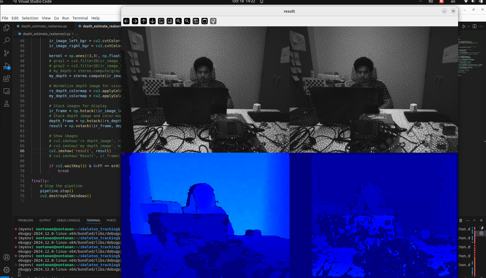

# gensurv stereo camera
make stereo camera using 2 camera. how to estimate depth in an image or in a camera. We can then operate with 3D images instead of only 2D with one camera. This can be combined with an obstacle detection algorithm as well, and we can get a position of the detected obstacle and the distance to it. We will in this video see what the different steps are and go over a practical example as well.
how to use packages step.
- install packages
- calibration camera
- depth esitmation
## Table of Contents (สารบัญ)
- [Requirement](#requirement)
- [Installation](#installation)
- [Calibrate the camera](#calibrate-the-camera)
- [Estimate depth image](#estimate-depth-image)
- [Result](#result)
## 0. Requirement
รายละเอียดเกี่ยวกับความต้องการของระบบหรือไลบรารีที่จำเป็น
## 1. Installation
ขั้นตอนการติดตั้งแพ็กเกจต่างๆ ที่ใช้ในโปรเจกต์นี้
## 2. Calibrate the camera
### 2.1 open camera using v4l2 camera by tier 4
### 2.2 open camera using opencv
## 3. Estimate depth image
### 3.1 sgbm algorithm
### 3.2 gbm algorighm
## 4. Result
### 4.1 compare with realsense d453

## Development: Nontanan@gensurv.com